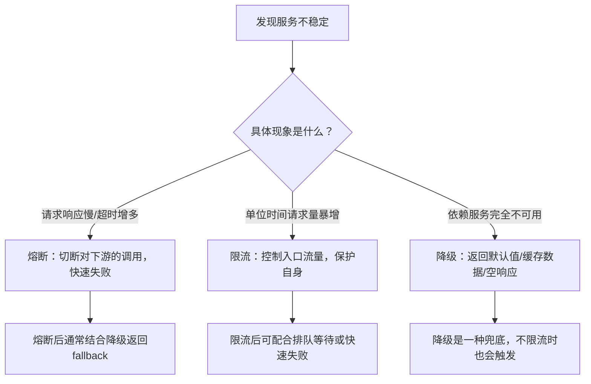

# Spring Cloud Alibaba 微服务实战笔记

> 基于电商系统（商品、订单、用户）案例，系统讲解 Spring Cloud Alibaba 微服务技术栈
> **版本基线**：Spring Boot 2.6.13 + Spring Cloud Alibaba 2021.0.5.0 + Nacos 2.2.0
> **适用读者**：具备Spring Boot基础，希望掌握生产级微服务架构的开发者

---

## 第一章 微服务介绍

### 1.1 系统架构演变

随着互联网的发展，系统架构大体经历了以下过程：

单体应用架构 → 垂直应用架构 → 分布式架构 → SOA架构 → 微服务架构

#### 1.1.1 单体应用架构

互联网早期，所有功能代码部署在一起，减少开发、部署和维护成本。

- **优点**：项目架构简单，开发成本低；维护方便
- **缺点**：全部功能集成在一个工程中，大型项目不易开发和维护；模块间紧耦合，单点容错率低；无法针对性优化和水平扩展

#### 1.1.2 垂直应用架构

将原来的一个应用拆成互不相干的几个应用，以提升效率。

- **优点**：实现流量分担，解决并发问题；可针对不同模块优化和水平扩展；提高容错率
- **缺点**：系统之间相互独立，无法相互调用；会有重复的开发任务

#### 1.1.3 分布式架构

将工程拆分成表现层和服务层，服务层包含业务逻辑，表现层处理页面交互，调用服务层实现业务。

- **优点**：抽取公共功能为服务层，提高代码复用性
- **缺点**：系统间耦合度变高，调用关系错综复杂，难以维护

#### 1.1.4 SOA架构

增加调度中心对集群进行实时管理，即面向服务的架构。

- **优点**：使用注册中心解决了服务间调用关系的自动调节
- **缺点**：服务间有依赖关系，一旦出错影响较大（服务雪崩）；服务关系复杂，运维、测试部署困难

#### 1.1.5 微服务架构

微服务架构更加强调服务的"彻底拆分"。

- **优点**：服务原子化拆分，独立打包、部署和升级；采用Restful等轻量级HTTP协议相互调用
- **缺点**：分布式系统开发的技术成本高（容错、分布式事务等）

### 1.2 微服务架构介绍

微服务架构就是将单体应用进一步拆分，拆分成更小的服务，每个服务都是可以独立运行的项目。

#### 1.2.1 微服务架构的常见问题

- 这么多小服务，如何管理？→ 服务治理（注册中心）
- 这么多小服务，如何通讯？→ Restful / RPC
- 这么多小服务，客户端怎么访问？→ 网关
- 这么多小服务，出现问题如何自处理？→ 容错
- 这么多小服务，出现问题如何排错？→ 链路追踪

#### 1.2.2 微服务架构的常见概念

##### 1.2.2.1 服务治理

服务治理核心是服务的自动注册与发现：

- **服务注册**：服务实例将自身信息注册到注册中心
- **服务发现**：服务实例通过注册中心获取其他服务实例信息
- **服务剔除**：注册中心将出问题的服务自动剔除
- **服务心跳**：注册中心通过心跳检测服务实例的健康状态，失联则剔除

##### 1.2.2.2 服务调用

| 比较项   | RESTful    | RPC         |
| -------- | ---------- | ----------- |
| 通讯协议 | HTTP       | 一般使用TCP |
| 性能     | 略低       | 较高        |
| 灵活度   | 高         | 低          |
| 应用     | 微服务架构 | SOA架构     |

> **选型建议**：对性能要求不高、追求开发效率时使用RESTful（如Spring Cloud OpenFeign）；对性能敏感、服务内聚时可使用RPC（如Dubbo）。两者也可混合使用。

##### 1.2.2.3 服务网关

API网关统一接入所有API调用，基本功能：统一接入、安全防护、协议适配、流量管控、长短链接支持、容错能力。

##### 1.2.2.4 服务容错

服务容错三个核心思想：不被外界环境影响、不被上游请求压垮、不被下游响应拖垮。

##### 1.2.2.5 链路追踪

对一次请求涉及的多个服务链路进行日志记录、性能监控。

#### 1.2.3 微服务架构的常见解决方案

- **ServiceComb**：Apache华为微服务顶级项目
- **SpringCloud**：一系列框架集合，利用Spring Boot简化分布式系统开发
- **SpringCloud Alibaba**：致力于提供微服务开发一站式解决方案

### 1.3 SpringCloud Alibaba介绍

Spring Cloud Alibaba 致力于提供微服务开发的一站式解决方案，只需添加注解和少量配置即可接入阿里微服务解决方案。

#### 1.3.1 主要功能

- 服务限流降级
- 服务注册与发现
- 分布式配置管理
- 消息驱动能力
- 分布式事务
- 阿里云对象存储
- 分布式任务调度
- 阿里云短信服务

#### 1.3.2 组件

| 组件                     | 说明                                 |
| ------------------------ | ------------------------------------ |
| Sentinel                 | 流量控制、熔断降级、系统负载保护     |
| Nacos                    | 动态服务发现、配置管理和服务管理平台 |
| RocketMQ                 | 开源分布式消息系统                   |
| Dubbo                    | 高性能 Java RPC 框架                 |
| Seata                    | 微服务分布式事务解决方案             |
| Alibaba Cloud ACM        | 应用配置中心                         |
| Alibaba Cloud OSS        | 对象存储服务                         |
| Alibaba Cloud SchedulerX | 分布式任务调度                       |
| Alibaba Cloud SMS        | 短信服务                             |

---

## 第二章 微服务环境搭建

### 2.1 案例准备

#### 2.1.1 技术选型

| 组件                 | 版本           | 说明                        |
| -------------------- | -------------- | --------------------------- |
| JDK                  | 1.8           | 推荐OpenJDK 11              |
| Maven                | 3.8.6          | -                           |
| MySQL                | 5.7            | 使用InnoDB引擎              |
| Spring Boot          | **2.6.13**     | 稳定版本                    |
| Spring Cloud         | 2021.0.5       | 对应Spring Boot 2.6.x       |
| Spring Cloud Alibaba | **2021.0.5.0** | 与Spring Cloud 2021.0.x兼容 |
| Nacos                | **2.2.0**      | 服务注册/配置中心           |
| Sentinel             | 1.8.6          | 服务容错                    |
| RocketMQ             | 4.9.4          | 消息驱动                    |
| Seata                | 1.5.2          | 分布式事务                  |
| Zipkin               | 2.23.2         | 链路追踪展示                |

> **兼容性注意**：Spring Cloud Alibaba 2021.0.5.0 对应 Spring Boot 2.6.13 和 Spring Cloud 2021.0.5，不可随意升级单个组件版本，避免出现API不兼容。

#### 2.1.2 模块设计

| 模块                | 说明               | 端口 |
| ------------------- | ------------------ | ---- |
| springcloud-alibaba | 父工程             | -    |
| shop-common         | 公共模块（实体类） | -    |
| shop-user           | 用户微服务         | 807x |
| shop-product        | 商品微服务         | 808x |
| shop-order          | 订单微服务         | 809x |
| api-gateway         | 网关服务           | 9000 |

#### 2.1.3 微服务调用

服务主动调用方 → 服务消费者；服务被调用方 → 服务提供者

### 2.2 创建父工程

创建maven工程，pom.xml中引入SpringBoot、SpringCloud、SpringCloud Alibaba依赖管理。版本号参考2.1.1节对照表。

```xml
<parent>
    <groupId>org.springframework.boot</groupId>
    <artifactId>spring-boot-starter-parent</artifactId>
    <version>2.6.13</version>
</parent>

<dependencyManagement>
    <dependencies>
        <dependency>
            <groupId>org.springframework.cloud</groupId>
            <artifactId>spring-cloud-dependencies</artifactId>
            <version>2021.0.5</version>
            <type>pom</type>
            <scope>import</scope>
        </dependency>
        <dependency>
            <groupId>com.alibaba.cloud</groupId>
            <artifactId>spring-cloud-alibaba-dependencies</artifactId>
            <version>2021.0.5.0</version>
            <type>pom</type>
            <scope>import</scope>
        </dependency>
    </dependencies>
</dependencyManagement>
```

### 2.3 创建基础模块

创建shop-common模块，添加JPA、Lombok、FastJSON、MySQL依赖，定义实体类：

- **User**：uid, username, password, telephone
- **Product**：pid, pname, pprice, stock
- **Order**：oid, uid, username, pid, pname, pprice, number

### 2.4 创建用户微服务

1. 创建模块，导入依赖
2. 创建SpringBoot主类
3. 加入配置文件
4. 创建必要的接口和实现类（controller/service/dao）

### 2.5 创建商品微服务

1. 创建shop-product模块，添加SpringBoot依赖
2. 创建工程主类
3. 创建配置文件application.yml
4. 创建ProductDao接口
5. 创建ProductService接口和实现类
6. 创建Controller
7. 启动工程，添加测试数据
8. 通过浏览器访问服务

### 2.6 创建订单微服务

1. 创建shop-order模块
2. 创建工程主类
3. 创建配置文件
4. 创建OrderDao接口
5. 创建OrderService接口和实现类
6. 创建RestTemplate
7. 创建Controller，通过RestTemplate调用商品微服务
8. 启动测试

---

## 第三章 Nacos Discovery——服务治理

### 3.1 服务治理介绍

硬编码服务地址存在的问题：地址变化需手工修改代码、无法实现负载均衡、人工维护调用关系困难。

**服务治理**核心功能：
- 服务发现：服务注册、服务订阅
- 服务配置：配置订阅、配置下发
- 服务健康检测

**常见注册中心**：

| 注册中心 | CAP模型 | 健康检查方式 | 特点 |
|----------|---------|-------------|------|
| Zookeeper | CP | 长连接+Session | 强一致性，性能一般 |
| Eureka | AP | 心跳 | 自我保护机制，已停更 |
| Consul | CP | TCP/HTTP/gRPC | 支持多数据中心 |
| Nacos | AP/CP | 心跳+推送 | 同时支持AP和CP，功能最全 |

### 3.2 Nacos简介

Nacos致力于帮助发现、配置和管理微服务，提供动态服务发现、服务配置、服务元数据及流量管理。可认为 nacos = eureka + config。

**Nacos架构**：
- **Nacos Server**：提供注册中心和配置中心功能，支持集群部署
- **Nacos Client**：与Server通过gRPC/HTTP通信，完成注册、发现、配置拉取

**临时实例 vs 持久实例**：
- 临时实例（默认）：客户端主动心跳，不健康时自动剔除
- 持久实例：服务端主动探测，不健康时标记为不健康但不剔除

### 3.3 Nacos实战入门

#### 3.3.1 搭建Nacos环境

1. 下载Nacos 2.2.0安装包并解压
2. 启动（单机模式）：
   - Windows: `startup.cmd -m standalone`
   - Linux/Mac: `sh startup.sh -m standalone`
3. 访问：http://localhost:8848/nacos，默认密码 nacos/nacos

> **集群模式**：修改 `cluster.conf` 配置节点列表，使用MySQL作为后端存储（修改 `application.properties` 中的 `spring.datasource.*` 配置）。

#### 3.3.2 将商品微服务注册到Nacos

1. pom.xml添加nacos依赖

```xml
<dependency>
    <groupId>com.alibaba.cloud</groupId>
    <artifactId>spring-cloud-starter-alibaba-nacos-discovery</artifactId>
</dependency>
```

2. 主类添加`@EnableDiscoveryClient`注解
3. application.yml添加nacos地址

```yaml
spring:
  cloud:
    nacos:
      discovery:
        server-addr: 127.0.0.1:8848
```

#### 3.3.3 将订单微服务注册到Nacos

1. pom.xml添加nacos依赖
2. 主类添加`@EnableDiscoveryClient`注解
3. application.yml添加nacos地址
4. 修改OrderController，使用DiscoveryClient获取服务地址

```java
@Autowired
private DiscoveryClient discoveryClient;

// 获取服务实例列表
List<ServiceInstance> instances = discoveryClient.getInstances("service-product");
// 随机选择一个实例实现简单负载均衡
int index = new Random().nextInt(instances.size());
ServiceInstance instance = instances.get(index);
String url = instance.getHost() + ":" + instance.getPort();
```

### 3.4 实现服务调用的负载均衡

#### 3.4.1 什么是负载均衡

- **服务端负载均衡**：发生在服务提供者一方（如Nginx）
- **客户端负载均衡**：发生在服务请求一方（微服务调用一般选择此方式）

#### 3.4.2 自定义实现负载均衡

通过DiscoveryClient获取服务实例列表，随机选择实例实现负载均衡。

#### 3.4.3 基于Ribbon实现负载均衡

1. 在RestTemplate生成方法上添加`@LoadBalanced`注解
2. 直接使用微服务名称调用

```java
@Bean
@LoadBalanced
public RestTemplate restTemplate() {
    return new RestTemplate();
}
```

```java
// 使用服务名替代IP:端口
Product product = restTemplate.getForObject("http://service-product/product/" + pid, Product.class);
```

**Ribbon支持的负载均衡策略**：

| 策略名                    | 策略描述                     |
| ------------------------- | ---------------------------- |
| BestAvailableRule         | 选择最小并发请求的server     |
| AvailabilityFilteringRule | 过滤掉连接失败和高并发的server |
| WeightedResponseTimeRule  | 根据响应时间分配权重         |
| RetryRule                 | 重试机制                     |
| RoundRobinRule            | 轮询方式                     |
| RandomRule                | 随机选择                     |
| ZoneAvoidanceRule         | 复合判断区域性能和可用性（默认） |

可通过配置调整策略：`service-product.ribbon.NFLoadBalancerRuleClassName=com.netflix.loadbalancer.RandomRule`

> **注意**：Spring Cloud 2021.x已移除Ribbon，改用Spring Cloud LoadBalancer。新项目建议使用`spring-cloud-starter-loadbalancer`替代。

### 3.5 基于Feign实现服务调用

#### 3.5.1 什么是Feign

Feign是Spring Cloud提供的声明式伪Http客户端，使得调用远程服务就像调用本地服务一样简单。Feign默认集成了Ribbon/LoadBalancer，默认实现负载均衡。

#### 3.5.2 Feign的使用

1. 加入Feign依赖

```xml
<dependency>
    <groupId>org.springframework.cloud</groupId>
    <artifactId>spring-cloud-starter-openfeign</artifactId>
</dependency>
```

2. 主类添加`@EnableFeignClients`注解
3. 创建接口并使用`@FeignClient`声明调用

```java
@FeignClient(value = "service-product")
public interface ProductFeignClient {
    @GetMapping("/product/{pid}")
    Product findByPid(@PathVariable("pid") Integer pid);
}
```

4. 修改Controller，注入Feign接口调用

#### 3.5.3 Feign超时配置

```yaml
feign:
  client:
    config:
      default:
        connectTimeout: 5000  # 连接超时5秒
        readTimeout: 10000    # 读取超时10秒
```

---

## 第四章 Sentinel——服务容错

### 4.1 高并发带来的问题

在高并发场景下，若某个服务出现问题导致网络延迟，大量请求涌入会形成任务堆积，最终导致服务瘫痪。

### 4.2 服务雪崩效应

由于服务间依赖性，故障会传播，对整个微服务系统造成灾难性后果——"雪崩效应"。我们无法杜绝雪崩源头，只能做好容错，保证"雪落而不雪崩"。

### 4.3 常见容错方案

#### 常见容错思路

- **隔离**：将系统划分为若干独立模块，常用线程池隔离和信号量隔离
- **超时**：设置最大响应时间，超时断开请求
- **限流**：限制系统输入输出流量
- **熔断**：暂时切断对下游服务的调用，三种状态：Closed → Open → Half-Open
- **降级**：为服务提供托底方案

#### 决策树：什么时候用熔断、限流、降级？



| 场景                         | 推荐策略                | 说明                               |
| ---------------------------- | ----------------------- | ---------------------------------- |
| 下游服务响应时间突增         | 熔断 + 降级             | 熔断避免线程堆积，降级返回友好提示 |
| 自身服务被突发流量冲击       | 限流（QPS/线程数）      | 保护自身不被压垮                   |
| 秒杀/抢购活动                | 热点参数限流 + 排队等待 | 针对商品ID限流，让请求匀速通过     |
| 依赖服务不可用（如数据库挂） | 降级                    | 直接返回兜底数据或缓存             |
| 系统整体负载过高（CPU/内存） | 系统自适应保护          | Sentinel系统规则自动调整入口流量   |

#### 常见容错组件

| 对比项   | Sentinel                 | Hystrix（已停更） | Resilience4J    |
| -------- | ------------------------ | ----------------- | --------------- |
| 隔离策略 | 信号量隔离               | 线程池/信号量     | 信号量隔离      |
| 熔断策略 | 响应时间/异常比/异常数   | 异常比            | 异常比/响应时间 |
| 限流     | QPS/线程数，支持调用关系 | 有限支持          | RateLimiter     |
| 控制台   | 功能强大的Dashboard      | 简单监控          | 不提供          |

### 4.4 Sentinel入门

#### 4.4.1 什么是Sentinel

Sentinel（分布式系统的流量防卫兵）是阿里开源的服务容错综合性解决方案，以流量为切入点，从流量控制、熔断降级、系统负载保护等多维度保护服务稳定性。

**特征**：
- 丰富的应用场景（承接近10年双十一大促流量核心场景）
- 完备的实时监控
- 广泛的开源生态
- 完善的SPI扩展点

**Sentinel分为两部分**：
- 核心库（Java客户端）：不依赖任何框架/库
- 控制台（Dashboard）：基于Spring Boot开发

#### 4.4.2 微服务集成Sentinel

1. pom.xml添加sentinel依赖

```xml
<dependency>
    <groupId>com.alibaba.cloud</groupId>
    <artifactId>spring-cloud-starter-alibaba-sentinel</artifactId>
</dependency>
```

2. 编写Controller测试

#### 4.4.3 安装Sentinel控制台

1. 下载jar包
2. 启动：`java -Dserver.port=8080 -Dcsp.sentinel.dashboard.server=localhost:8080 -Dproject.name=sentinel-dashboard -jar sentinel-dashboard-1.8.6.jar`
3. 微服务中配置控制台地址和通信端口

```yaml
spring:
  cloud:
    sentinel:
      transport:
        dashboard: localhost:8080
        port: 8719
```

#### 4.4.4 实现一个接口的限流

通过控制台为接口添加流控规则，快速频繁访问观察限流效果。

### 4.5 Sentinel的概念和功能

#### 4.5.1 基本概念

- **资源**：Sentinel要保护的东西，可以是服务、方法或代码
- **规则**：定义如何保护资源，包括流量控制规则、熔断降级规则、系统保护规则

#### 4.5.2 重要功能

- **流量控制**：根据系统处理能力对流量进行控制
- **熔断降级**：
  - 通过并发线程数进行限制
  - 通过响应时间对资源进行降级
- **系统负载保护**：系统维度的自适应保护能力

### 4.6 Sentinel规则

#### 4.6.1 流控规则

监控QPS或并发线程数，达到阈值时对流量进行控制。

- **资源名**：唯一名称
- **针对来源**：指定对哪个微服务限流
- **阈值类型**：QPS / 线程数

##### 4.6.1.1 简单配置

设置QPS阈值为3，每秒请求量大于3时开始限流。

##### 4.6.1.2 配置流控模式

- **直接**（默认）：接口达到限流条件时开启限流
- **关联**：关联资源达到限流条件时，对指定接口限流（适合应用让步）
- **链路**：从某个接口过来的资源达到限流条件时开启限流（粒度更细）

##### 4.6.1.3 配置流控效果

- **快速失败**（默认）：直接失败，抛出异常
- **Warm Up**：从阈值1/3慢慢增长到最大QPS阈值（适用于冷系统预热）
- **排队等待**：请求以均匀速度通过，超时丢弃（适用于削峰填谷）

#### 4.6.2 降级规则

三个衡量条件：
- **平均响应时间**：超过阈值后进入准降级状态（时间窗口≥1s）
- **异常比例**：异常总数占通过量比值超过阈值
- **异常数**：近1分钟异常数目超过阈值

#### 4.6.3 热点规则

热点参数流控规则，允许将规则具体到参数上。需使用`@SentinelResource`注解标识。

参数例外项允许对一个参数的具体值进行流控。

#### 4.6.4 授权规则

根据调用来源判断请求是否允许放行：
- 白名单：只有来源在白名单内才可通过
- 黑名单：来源在黑名单时不通过

需自定义RequestOriginParser实现类来解析访问来源。

#### 4.6.5 系统规则

从应用级别入口流量进行控制，五个维度：

| 维度      | 说明                         | 生产建议                             |
| --------- | ---------------------------- | ------------------------------------ |
| Load      | 系统平均负载（仅Unix/Linux） | 建议设置为 `core * 0.75`，如4核设置3 |
| RT        | 所有入口流量的平均响应时间   | 建议设置200ms或500ms                 |
| 线程数    | 入口流量并发线程数           | 根据业务模型，一般设置为100~500      |
| 入口QPS   | 应用总QPS                    | 通过压测得出安全值，设为阈值的80%    |
| CPU使用率 | 系统CPU利用率                | 建议设置0.7~0.8（70%~80%）           |

**自定义异常返回**：实现UrlBlockHandler接口，处理BlockException的五种子异常（FlowException、DegradeException、ParamFlowException、AuthorityException、SystemBlockException）。

### 4.7 @SentinelResource的使用

@SentinelResource用于定义资源，并提供可选的异常处理和fallback配置。

| 属性              | 作用                                      |
| ----------------- | ----------------------------------------- |
| value             | 资源名称                                  |
| entryType         | entry类型，默认OUT                        |
| blockHandler      | 处理BlockException的函数名称              |
| blockHandlerClass | 存放blockHandler的类，方法必须static      |
| fallback          | 抛出异常时的fallback处理逻辑              |
| fallbackClass     | 存放fallback的类，方法必须static          |
| defaultFallback   | 通用fallback逻辑                          |
| exceptionsToIgnore | 排除的异常，不计入统计也不进入fallback   |

**定义限流和降级处理方法**：

> **修正说明**：`blockHandler` 如果直接写在当前类中，**不需要** `static` 修饰；如果写在 `blockHandlerClass` 指定的类中，则方法必须为 `static`。`fallback` 同理。

```java
// 方式一：本类内方法，可以非static
@SentinelResource(value = "test", blockHandler = "blockHandler")
public String test() { ... }
public String blockHandler(BlockException ex) { ... }

// 方式二：外部类，方法必须是static
@SentinelResource(value = "test", blockHandler = "handle", blockHandlerClass = MyBlockHandler.class)
public String test() { ... }

public class MyBlockHandler {
    public static String handle(BlockException ex) { ... }
}
```

### 4.8 Sentinel规则持久化

默认规则存放在内存中极不稳定，需要持久化。以本地文件数据源为例：

1. 编写FilePersistence处理类，实现InitFunc接口
2. 在META-INF/services下添加com.alibaba.csp.sentinel.init.InitFunc文件，写入配置类全路径

> **生产推荐**：使用Nacos作为Sentinel规则的数据源，实现规则集中管理和动态推送。

```xml
<dependency>
    <groupId>com.alibaba.csp</groupId>
    <artifactId>sentinel-datasource-nacos</artifactId>
</dependency>
```

```yaml
spring:
  cloud:
    sentinel:
      datasource:
        flow:
          nacos:
            server-addr: 127.0.0.1:8848
            dataId: ${spring.application.name}-flow-rules
            groupId: SENTINEL_GROUP
            rule-type: flow
```

### 4.9 Feign整合Sentinel

1. 引入sentinel依赖
2. 配置文件开启：`feign.sentinel.enabled=true`
3. 创建容错类，实现被容错的接口
4. 为接口指定容错类：`@FeignClient(value="service-product", fallback=ProductServiceFallBack.class)`
5. 修改Controller处理容错结果

**扩展**：使用fallbackFactory获取具体错误信息：

`@FeignClient(value="service-product", fallbackFactory=ProductServiceFallBackFactory.class)`

> 注意：fallback和fallbackFactory只能使用其中一种方式

### 4.10 真实场景案例：秒杀热点参数限流 + 排队等待 + 自定义异常返回

**场景**：秒杀商品ID=1001，瞬时并发5000/s，系统只能处理500/s。

**解决方案**：

1. **热点参数限流**：针对`商品ID`参数限流，QPS阈值=500。
2. **排队等待**：设置流控效果为"排队等待"，超时时间5000ms，使请求匀速通过。
3. **自定义异常返回**：被限流时返回"抢购火爆，请稍后再试"JSON。

**代码实现**：

```java
@RestController
public class SeckillController {

    @GetMapping("/seckill/{productId}")
    @SentinelResource(value = "seckill",
        blockHandler = "handleBlock",
        blockHandlerClass = SeckillBlockHandler.class)
    public String seckill(@PathVariable Integer productId) {
        return "秒杀成功（商品ID:" + productId + "）";
    }
}

// 外部限流处理类（方法需static）
public class SeckillBlockHandler {
    public static String handleBlock(Integer productId, BlockException ex) {
        return "{\"code\":429,\"msg\":\"抢购火爆，请稍后再试\"}";
    }
}
```

**控制台配置**：

- 资源名：`seckill`
- 限流模式：热点参数限流
- 参数索引：0（第一个参数）
- 单机阈值：500
- 流控效果：排队等待（超时5秒）
- 参数例外项：可针对特定商品ID设置不同阈值

---

## 第五章 Gateway——服务网关

### 5.1 网关简介

没有网关存在的问题：客户端多次请求不同微服务增加复杂性、每个服务需独立认证、跨域请求处理复杂。

API网关是系统的统一入口，封装应用程序内部结构，实现认证、鉴权、监控、路由转发等公共逻辑。

**常见网关**：
- Nginx+lua
- Kong
- Zuul
- Spring Cloud Gateway

### 5.2 Gateway简介

Spring Cloud Gateway基于Spring 5.0、Spring Boot 2.0和Project Reactor开发，旨在替代Netflix Zuul。

- **优点**：性能强劲（基于Netty异步非阻塞模型，远优于Zuul 1.x），功能强大，设计优雅易扩展
- **缺点**：依赖Netty与WebFlux，学习成本高；不支持Servlet容器部署；需Spring Boot 2.0+

> **性能说明**：实际压测显示Spring Cloud Gateway的吞吐量是Zuul 1.x的1.6~2倍，且资源占用更低。

### 5.3 Gateway快速入门

#### 5.3.1 基础版

1. 创建api-gateway模块，导入spring-cloud-starter-gateway依赖
2. 创建主类
3. 添加配置文件（路由配置：id、uri、predicates、filters）
4. 启动项目通过网关访问微服务

```yaml
server:
  port: 9000

spring:
  cloud:
    gateway:
      routes:
        - id: product_route
          uri: http://localhost:8081
          predicates:
            - Path=/product/**
          filters:
            - StripPrefix=0
```

#### 5.3.2 增强版

从注册中心获取服务地址：
1. 加入nacos依赖
2. 主类添加`@EnableDiscoveryClient`
3. 配置uri为`lb://service-product`（lb表示从nacos获取并负载均衡）

```yaml
spring:
  cloud:
    gateway:
      routes:
        - id: product_route
          uri: lb://service-product
          predicates:
            - Path=/product/**
```

#### 5.3.3 简写版

开启`spring.cloud.gateway.discovery.locator.enabled=true`，按照网关地址/微服务名/接口格式访问。

### 5.4 Gateway核心架构

#### 5.4.1 基本概念

路由（Route）主要定义：
- **id**：路由标识符
- **uri**：目的地uri
- **order**：排序，数值越小优先级越高
- **predicate**：断言，条件判断
- **filter**：过滤器，修改请求和响应

#### 5.4.2 执行流程

1. Gateway Client发送请求
2. HttpWebHandlerAdapter提取组装网关上下文
3. DispatcherHandler分发请求到RoutePredicateHandlerMapping
4. 路由查找，断言判断
5. FilteringWebHandler创建过滤器链
6. 请求经过PreFilter → 微服务 → PostFilter，返回响应

### 5.5 断言

Predicate用于条件判断，只有断言返回真才执行路由。

#### 5.5.1 内置路由断言工厂

| 断言工厂                    | 说明             | 示例                                              |
| --------------------------- | ---------------- | ------------------------------------------------- |
| AfterRoutePredicateFactory  | 请求日期晚于指定日期   | `-After=2019-12-31T23:59:59.789+08:00[Asia/Shanghai]` |
| BeforeRoutePredicateFactory | 请求日期早于指定日期   | -                                                 |
| BetweenRoutePredicateFactory | 请求日期在指定时间段内 | -                                                 |
| RemoteAddrRoutePredicateFactory | 请求IP在地址段中   | `-RemoteAddr=192.168.1.1/24`                      |
| CookieRoutePredicateFactory | Cookie匹配正则   | `-Cookie=chocolate, ch.`                          |
| HeaderRoutePredicateFactory | Header匹配正则   | `-Header=X-Request-Id, \d+`                       |
| HostRoutePredicateFactory   | Host匹配         | `-Host=**.testhost.org`                           |
| MethodRoutePredicateFactory | 请求类型匹配     | `-Method=GET`                                     |
| PathRoutePredicateFactory   | 请求路径匹配     | `-Path=/foo/{segment}`                            |
| QueryRoutePredicateFactory  | 请求参数匹配     | `-Query=baz, ba.`                                 |
| WeightRoutePredicateFactory | 按权重转发       | `-Weight=group3, 1`                               |

#### 5.5.2 自定义路由断言工厂

以Age断言为例：
1. 配置文件添加Age断言配置：`-Age=18,60`
2. 自定义断言工厂，继承AbstractRoutePredicateFactory
3. 实现shortcutFieldOrder和apply方法

### 5.6 过滤器

#### 5.6.1 局部过滤器

针对单个路由的过滤器。

**内置局部过滤器**（部分）：

| 过滤器工厂          | 作用                     |
| ------------------- | ------------------------ |
| AddRequestHeader    | 为原始请求添加Header     |
| AddRequestParameter | 为原始请求添加请求参数   |
| PrefixPath          | 为原始请求路径添加前缀   |
| RequestRateLimiter  | 请求限流（令牌桶）       |
| RedirectTo          | 重定向                   |
| RewritePath         | 重写请求路径             |
| StripPrefix         | 截断请求路径             |
| SetStatus           | 修改响应状态码           |
| Retry               | 重试                     |

**自定义局部过滤器**：继承AbstractGatewayFilterFactory，实现shortcutFieldOrder和apply方法。

#### 5.6.2 全局过滤器

作用于所有路由，无需配置。

**自定义全局过滤器**：实现GlobalFilter和Ordered接口，如统一鉴权过滤器（校验token参数）。

```java
@Component
public class AuthGlobalFilter implements GlobalFilter, Ordered {

    @Override
    public Mono<Void> filter(ServerWebExchange exchange, GatewayFilterChain chain) {
        String token = exchange.getRequest().getQueryParams().getFirst("token");
        if (StringUtils.isEmpty(token)) {
            exchange.getResponse().setStatusCode(HttpStatus.UNAUTHORIZED);
            return exchange.getResponse().setComplete();
        }
        return chain.filter(exchange);
    }

    @Override
    public int getOrder() {
        return 0;
    }
}
```

### 5.7 网关限流

使用Sentinel实现网关限流，支持两种资源维度：
- **route维度**：资源名为对应routeId
- **自定义API维度**：利用API自定义分组

#### 5.7.1 使用Sentinel实现网关限流

**步骤1**：引入依赖

```xml
<dependency>
    <groupId>com.alibaba.cloud</groupId>
    <artifactId>spring-cloud-starter-alibaba-sentinel</artifactId>
</dependency>
<dependency>
    <groupId>com.alibaba.cloud</groupId>
    <artifactId>spring-cloud-alibaba-sentinel-gateway</artifactId>
</dependency>
```

**步骤2**：配置application.yml

```yaml
spring:
  cloud:
    sentinel:
      transport:
        dashboard: localhost:8080
        port: 8719
      filter:
        enabled: true
      scg:
        fallback:
          mode: response
          response-body: '{"code":429,"message":"请求限流"}'
```

**步骤3**：通过代码定义API分组和网关流控规则

```java
@Configuration
public class GatewaySentinelConfig {

    @PostConstruct
    public void initGatewayRules() {
        // 1. 定义API分组
        Set<ApiDefinition> apiDefinitions = new HashSet<>();
        ApiDefinition productApi = new ApiDefinition("product_api")
                .setPredicateItems(new HashSet<ApiPredicateItem>() {{
                    add(new ApiPathPredicateItem().setPattern("/product/**")
                        .setMatchStrategy(SentinelGatewayConstants.URL_MATCH_STRATEGY_PREFIX));
                }});
        ApiDefinition orderApi = new ApiDefinition("order_api")
                .setPredicateItems(new HashSet<ApiPredicateItem>() {{
                    add(new ApiPathPredicateItem().setPattern("/order/**")
                        .setMatchStrategy(SentinelGatewayConstants.URL_MATCH_STRATEGY_PREFIX));
                }});
        apiDefinitions.add(productApi);
        apiDefinitions.add(orderApi);
        GatewayApiDefinitionManager.loadApiDefinitions(apiDefinitions);

        // 2. 定义网关流控规则
        Set<GatewayFlowRule> rules = new HashSet<>();
        rules.add(new GatewayFlowRule("product_api")
                .setResourceMode(SentinelGatewayConstants.RESOURCE_MODE_CUSTOM_API_NAME)
                .setCount(100)
                .setIntervalSec(1));
        rules.add(new GatewayFlowRule("order_api")
                .setResourceMode(SentinelGatewayConstants.RESOURCE_MODE_CUSTOM_API_NAME)
                .setCount(200)
                .setIntervalSec(1));
        GatewayRuleManager.loadRules(rules);
    }
}
```

**步骤4**：自定义限流异常响应

```java
@Configuration
public class GatewayConfig {

    @PostConstruct
    public void initBlockHandler() {
        GatewayCallbackManager.setBlockHandler((exchange, t) -> {
            Map<String, Object> result = new HashMap<>();
            result.put("code", 429);
            result.put("msg", "访问过于频繁，请稍后重试");
            return ServerWebExchangeContextHolder.getResponse(exchange)
                    .writeWith(Mono.just(exchange.getResponse().bufferFactory()
                            .wrap(JSON.toJSONBytes(result))));
        });
    }
}
```

#### 5.7.2 集群限流简介

Sentinel支持集群限流，需要引入**Token Server**和**Token Client**：

- **Token Server**：独立部署（或嵌入某一微服务），负责统计全局QPS并下发token。
- **Token Client**（每个网关节点）：向Token Server请求token，获取许可后才放行。

**配置步骤**：
1. 引入 `sentinel-cluster-client-default` 和 `sentinel-cluster-server-default` 依赖。
2. 在Token Server端配置 `ClusterFlowRule` 和 `ClusterServerConfigManager`。
3. 在客户端配置 `ClusterClientConfigManager` 指定Token Server地址。

适用场景：要求全局精确限流（如多节点网关对某个API的总QPS限制）。

### 5.8 Spring Cloud Gateway + OAuth2/JWT 认证实战

#### 5.8.1 网关层统一校验JWT并传递用户信息

**目标**：客户端请求携带JWT（位于Header `Authorization: Bearer <jwt>`），网关解析JWT，验证合法性，然后将用户信息（userId, authorities）通过Header传递给下游微服务。

**实现**：自定义全局过滤器 `JwtAuthenticationGlobalFilter`

```java
@Component
public class JwtAuthenticationGlobalFilter implements GlobalFilter, Ordered {

    private static final String SECRET_KEY = "your-256-bit-secret"; // 应与认证服务一致

    @Override
    public Mono<Void> filter(ServerWebExchange exchange, GatewayFilterChain chain) {
        ServerHttpRequest request = exchange.getRequest();
        String authHeader = request.getHeaders().getFirst(HttpHeaders.AUTHORIZATION);

        // 未携带token时放行（由具体服务决定是否需要认证）
        if (StringUtils.isEmpty(authHeader) || !authHeader.startsWith("Bearer ")) {
            return chain.filter(exchange);
        }

        String jwt = authHeader.substring(7);
        try {
            Claims claims = Jwts.parser()
                    .setSigningKey(SECRET_KEY.getBytes(StandardCharsets.UTF_8))
                    .parseClaimsJws(jwt)
                    .getBody();
            String userId = claims.getSubject();
            String authorities = claims.get("authorities", String.class);

            // 将用户信息添加到请求头中，传递给下游
            ServerHttpRequest mutatedRequest = request.mutate()
                    .header("X-User-Id", userId)
                    .header("X-User-Authorities", authorities)
                    .build();
            return chain.filter(exchange.mutate().request(mutatedRequest).build());
        } catch (ExpiredJwtException e) {
            return unauthorizedResponse(exchange, "Token expired");
        } catch (JwtException e) {
            return unauthorizedResponse(exchange, "Invalid token");
        }
    }

    private Mono<Void> unauthorizedResponse(ServerWebExchange exchange, String msg) {
        exchange.getResponse().setStatusCode(HttpStatus.UNAUTHORIZED);
        byte[] bytes = String.format("{\"code\":401,\"msg\":\"%s\"}", msg).getBytes(StandardCharsets.UTF_8);
        DataBuffer buffer = exchange.getResponse().bufferFactory().wrap(bytes);
        return exchange.getResponse().writeWith(Mono.just(buffer));
    }

    @Override
    public int getOrder() {
        return -100; // 优先执行
    }
}
```

#### 5.8.2 内部服务间认证（Feign拦截器传递Token）

场景：订单微服务需要调用商品微服务，订单服务没有原始客户端的JWT，但仍需进行服务间认证。

**方案**：使用Feign拦截器，将当前请求中的用户Header转发给下游。

```java
@Configuration
public class FeignConfig {
    @Bean
    public RequestInterceptor userInfoForwardInterceptor() {
        return template -> {
            ServletRequestAttributes attributes =
                (ServletRequestAttributes) RequestContextHolder.getRequestAttributes();
            if (attributes != null) {
                HttpServletRequest request = attributes.getRequest();
                String userId = request.getHeader("X-User-Id");
                String authorities = request.getHeader("X-User-Authorities");
                if (userId != null) {
                    template.header("X-User-Id", userId);
                }
                if (authorities != null) {
                    template.header("X-User-Authorities", authorities);
                }
            }
        };
    }
}
```

---

## 第六章 Sleuth——链路追踪

### 6.1 链路追踪介绍

分布式链路追踪将一次分布式请求还原成调用链路，进行日志记录和性能监控。

**常见链路追踪技术**：
- **cat**：大众点评开源，代码埋点，侵入性大
- **zipkin**：Twitter开源，结合spring-cloud-sleuth使用简单
- **pinpoint**：韩国开源，基于字节码注入，无代码侵入
- **skywalking**：本土开源，基于字节码注入，已加入Apache孵化器
- **Sleuth**：SpringCloud提供的分布式链路追踪解决方案

> SpringCloud Alibaba技术栈采用 Sleuth + Zipkin 做链路追踪

### 6.2 Sleuth入门

#### 6.2.1 Sleuth介绍

核心概念：
- **Trace**：由一组Trace Id相同的Span串联形成树状结构
- **Span**：基本工作单元，通过SpanId标记开始和结束
- **Annotation**：记录事件
  - cs（Client Send）：客户端发出请求
  - sr（Server Received）：服务端接收请求
  - ss（Server Send）：服务端处理完毕
  - cr（Client Received）：客户端接收响应

#### 6.2.2 Sleuth入门

1. 修改父工程引入Sleuth依赖
2. 启动微服务，控制台观察日志输出格式：`[微服务名称, traceId, spanId, 是否输出到第三方平台]`

#### 6.2.3 MDC自动适配：在日志中输出TraceId

Sleuth会自动将 `traceId` 和 `spanId` 放入SLF4J的MDC（Mapped Diagnostic Context）中。只需在日志配置文件中引用即可。

**logback-spring.xml 示例**：

```xml
<pattern>%d{yyyy-MM-dd HH:mm:ss.SSS} [%thread] %-5level [%X{traceId}] [%X{spanId}] - %msg%n</pattern>
```

输出示例：
```
2025-05-11 10:23:45.678 [http-nio-8080-exec-1] INFO [a1b2c3d4e5f6] [a1b2c3] - 处理订单...
```

**手动获取TraceId**：

```java
String traceId = MDC.get("traceId");
```

### 6.3 Zipkin的集成

#### 6.3.1 Zipkin介绍

Zipkin基于Google Dapper实现，收集服务的定时数据，解决微服务架构中的延迟问题。

**四个核心组件**：
- Collector（收集器）
- Storage（存储）
- RESTful API
- Web UI

#### 6.3.2 Zipkin服务端安装

1. 下载jar包
2. 启动：`java -jar zipkin-server-2.23.2-exec.jar`
3. 访问：http://localhost:9411

#### 6.3.3 Zipkin客户端集成

1. 添加依赖：spring-cloud-starter-zipkin
2. 添加配置：
   - `spring.zipkin.base-url`
   - `spring.sleuth.sampler.probability`（采样百分比，生产建议0.1~0.5）

### 6.4 Zipkin数据持久化

#### 6.4.1 使用MySQL实现数据持久化

1. 创建MySQL数据环境（zipkin_spans、zipkin_annotations、zipkin_dependencies表）
2. 启动时指定：`java -jar zipkin-server-2.23.2-exec.jar --STORAGE_TYPE=mysql --MYSQL_HOST=127.0.0.1 ...`

#### 6.4.2 使用Elasticsearch实现数据持久化

1. 下载elasticsearch
2. 启动elasticsearch
3. 启动时指定：`java -jar zipkin-server-2.23.2-exec.jar --STORAGE_TYPE=elasticsearch --ES-HOST=localhost:9200`

> **生产推荐**：Elasticsearch方案性能更优，适合高吞吐量场景。

### 6.5 日志聚合方案：通过TraceId快速检索

**目标**：微服务架构下，一次请求产生的日志分散在不同服务中。通过 `traceId` 可以在日志中心快速聚合所有相关日志。

#### 方案一：ELK（Elasticsearch + Logstash + Kibana）

1. 每个微服务将日志输出到文件（JSON格式）。
2. Filebeat采集日志发送给Logstash。
3. Logstash解析出 `traceId` 作为字段存入Elasticsearch。
4. Kibana中通过 `traceId: "a1b2c3d4e5f6"` 搜索。

**Logstash配置片段**：

```
filter {
  grok {
    match => { "message" => "\[%{TIMESTAMP_ISO8601:timestamp}\] \[%{DATA:thread}\] %{LOGLEVEL:level} \[%{DATA:traceId}\] \[%{DATA:spanId}\] - %{GREEDYDATA:msg}" }
  }
}
```

#### 方案二：Loki + Grafana（轻量级）

1. 使用Promtail采集日志，自动提取 `traceId`。
2. 在Grafana Explore中使用LogQL：
   ```
   {app="shop-order"} |= "a1b2c3d4e5f6"
   ```
3. 配合Tempo或Jaeger可实现Trace与Logs的联动。

---

## 第七章 RocketMQ——消息驱动

### 7.1 MQ简介

#### 7.1.1 什么是MQ

MQ（Message Queue）是一种跨进程的通信机制，用于传递消息，本质上是一个先进先出的数据结构。

#### 7.1.2 MQ的应用场景

##### 7.1.2.1 异步解耦

将耗时且不需要即时返回结果的操作放入消息队列异步执行，减少请求响应时间并解耦。

##### 7.1.2.2 流量削峰

在秒杀或抢购活动中，通过MQ缓冲海量请求，下游系统按自身能力消费消息。

#### 7.1.3 常见的MQ产品

| 产品      | 特点                                         |
| --------- | -------------------------------------------- |
| ZeroMQ    | 最快，C语言实现，非持久性                     |
| RabbitMQ  | erlang开发，性能好，不利于二次开发            |
| ActiveMQ  | 历史悠久，实现JMS规范，队列多时支持不好       |
| RocketMQ  | 阿里开源，Java开发，性能极好，撑住双十一      |
| Kafka     | Apache子项目，高性能，轻量级分布式系统        |

### 7.2 RocketMQ入门

#### 7.2.1 RocketMQ环境搭建

- 环境：Linux 64位 + 64bit JDK 1.8+
- 启动NameServer：`nohup ./bin/mqnamesrv &`
- 启动Broker：`nohup bin/mqbroker -n localhost:9876 &`

#### 7.2.2 RocketMQ的架构及概念

| 角色           | 说明                                         |
| -------------- | -------------------------------------------- |
| Broker         | 核心，负责消息接收、存储、投递               |
| NameServer     | 协调者，Broker注册路由信息                   |
| Producer       | 消息生产者                                   |
| Consumer       | 消息消费者                                   |
| Topic          | 区分不同类型消息                             |
| Message Queue  | 提高性能和吞吐量，一个Topic可有多个Queue     |
| Producer Group | 生产者组                                     |
| Consumer Group | 消费者组                                     |

#### 7.2.3 RocketMQ控制台安装

下载rocketmq-console，修改配置，打包启动。

### 7.3 消息发送和接收演示

#### 7.3.1 发送消息

1. 创建消息生产者，指定组名
2. 指定Nameserver地址
3. 启动生产者
4. 创建消息对象，指定主题、标签和消息体
5. 发送消息
6. 关闭生产者

#### 7.3.2 接收消息

1. 创建消息消费者，指定组名
2. 指定Nameserver地址
3. 指定订阅的主题和标签
4. 设置回调函数
5. 启动消息消费者

### 7.4 案例

模拟下单成功后发送短信的场景。

#### 7.4.1 订单微服务发送消息

1. 添加RocketMQ依赖
2. 添加配置
3. 使用RocketMQTemplate发送消息：`rocketMQTemplate.convertAndSend("order-topic", order)`

#### 7.4.2 用户微服务订阅消息

1. 添加RocketMQ依赖
2. 添加配置
3. 编写消息接收服务，使用`@RocketMQMessageListener`注解

### 7.5 发送不同类型的消息

#### 7.5.1 普通消息

| 发送方式 | 发送TPS | 结果反馈 | 可靠性   |
| -------- | ------- | -------- | -------- |
| 同步发送 | 快      | 有       | 不丢失   |
| 异步发送 | 快      | 有       | 不丢失   |
| 单向发送 | 最快    | 无       | 可能丢失 |

#### 7.5.2 顺序消息

严格按照顺序来发布和消费的消息类型。使用`syncSendOrderly`方法，第三个参数用于队列选择。

#### 7.5.3 事务消息

通过事务消息达到分布式事务的最终一致性。

**两个概念**：
- **半事务消息**：暂不能投递的消息，等待二次确认
- **消息回查**：服务端主动询问消息的最终状态

**事务消息发送步骤**：
1. 发送半事务消息
2. 服务端持久化后返回Ack
3. 执行本地事务逻辑
4. 提交二次确认（Commit/Rollback）

### 7.6 消息消费要注意的细节

RocketMQ支持两种消息模式：
- **广播消费**：每个消费者实例都会收到消息
- **集群消费**：一条消息只能被一个消费者实例消费（默认）

#### 7.6.1 消息可靠性保障

**生产者端**：
- **同步发送**：`SendResult sendResult = producer.send(msg);` 根据状态判断成功与否。
- **异步发送**：提供回调，失败时重试或记录。
- **事务消息**：保证本地事务与消息发送的原子性。

**配置示例**（使用RocketMQTemplate）：

```yaml
rocketmq:
  producer:
    group: order-producer-group
    send-message-timeout: 3000
    retry-times-when-send-failed: 2
    retry-next-server: true
```

**消费者端**：
- **手动ACK**：设置 `consumeMode = ConsumeMode.CONCURRENTLY`，监听器中返回 `ConsumeConcurrentlyStatus.RECONSUME_LATER` 会重试。

```java
@RocketMQMessageListener(topic = "order-topic", consumerGroup = "sms-group",
    consumeMode = ConsumeMode.CONCURRENTLY,
    maxReconsumeTimes = 3)
public class SmsListener implements RocketMQListener<Order> {
    @Override
    public void onMessage(Order order) {
        try {
            // 发送短信逻辑
        } catch (Exception e) {
            // 返回RECONSUME_LATER会重新投递
            throw new RuntimeException(e);
        }
    }
}
```

#### 7.6.2 消费幂等设计

问题：RocketMQ可能因重试导致同一条消息被多次消费。必须实现幂等。

**常用方案**：

| 方案          | 实现                                         | 适用场景   |
| ------------- | -------------------------------------------- | ---------- |
| 数据库唯一键  | 处理消息时插入业务流水表，用消息ID做唯一索引 | 所有场景   |
| Redis分布式锁 | `set nx ex`，以消息ID为key，成功则消费       | 高并发     |
| 业务状态机    | 检查订单状态，只有待支付才处理支付回调       | 有状态业务 |

**示例：数据库唯一键**

```sql
CREATE TABLE `mq_consumer_record` (
  `message_id` varchar(64) NOT NULL COMMENT 'RocketMQ消息ID',
  `topic` varchar(64) NOT NULL,
  `create_time` datetime DEFAULT CURRENT_TIMESTAMP,
  PRIMARY KEY (`message_id`)
);
```

消费时先插入记录，插入成功才执行业务；如果重复消费，插入会主键冲突，捕获异常跳过。

#### 7.6.3 RocketMQ Dashboard监控指标解读

**部署**：下载 `rocketmq-dashboard`，修改配置连接NameServer，启动。

**关键指标**：
- **消息堆积（Diff Total）**：生产者与消费者之间的未消费消息数量。持续增长表示消费能力不足。
- **生产TPS / 消费TPS**：两者应基本平衡。消费TPS低于生产TPS则堆积。
- **延迟消息**：已到达延迟时间但仍未被消费的消息。
- **死信队列（DLQ）**：重试超过最大次数后进入 `%DLQ%consumerGroup`，需要人工处理。

**告警建议**：
- 堆积量 > 1万且持续5分钟 → 触发告警
- 消费TPS < 生产TPS的80% → 扩容或优化消费者

---

## 第八章 SMS——短信服务

### 8.1 短信服务介绍

阿里云短信服务提供覆盖全面的通信能力，产品功能包括短信通知、验证码、推广短信等。

### 8.2 短信服务使用

#### 8.2.1 准备工作

1. 实名认证
2. 开通短信服务
3. 申请认证秘钥（AccessKey）
4. 申请短信签名
5. 申请短信模板

#### 8.2.2 短信服务API介绍

- **SendSms**：发送短信
- **QuerySendDetails**：查询短信发送记录和状态

#### 8.2.3 功能测试

1. 引入spring-cloud-alicloud-sms依赖
2. 使用阿里云提供的Demo测试

### 8.3 下单之后发送短信

1. 在shop-user模块加入sms依赖
2. 将阿里短信Demo封装成SmsUtil工具类
3. 修改短信发送服务，在RocketMQ消息监听器中调用SmsUtil发送短信

> **重要安全提醒**：阿里云短信服务的 AccessKey/SecretKey **严禁**硬编码在代码或配置文件中。应使用Nacos Config加密存储，或使用ECS/RAM角色授权获取临时凭证。

---

## 第九章 Nacos Config——服务配置

### 9.1 服务配置中心介绍

微服务架构下配置文件的问题：
1. 配置文件相对分散，不好统一管理
2. 配置文件无法区分环境
3. 配置文件无法实时更新

**配置中心思路**：集中管理配置 → 接口拉取配置 → 实时同步更新

**常见配置中心**：Apollo、Disconf、SpringCloud Config、Nacos

### 9.2 Nacos Config入门

1. 搭建Nacos环境
2. 引入nacos-config依赖
3. 新建bootstrap.yml配置文件（优先级高于application.yml）
4. 在Nacos中添加配置（注意Data ID对应关系和格式）
5. 注释本地配置，启动测试

**配置文件优先级**（由高到低）：
bootstrap.properties → bootstrap.yml → application.properties → application.yml

### 9.3 Nacos Config深入

#### 9.3.1 配置动态刷新

- **方式一**：硬编码方式，使用ConfigurableApplicationContext获取配置
- **方式二**（推荐）：注解方式，在类上添加`@RefreshScope`注解，使用`@Value`注入配置

#### 9.3.2 配置共享

**同一个微服务的不同环境之间共享配置**：

提取以spring.application.name命名的配置文件，存放公共配置。

**不同微服务之间共享配置**：

1. 定义公共配置（如all-service.yaml）
2. 在bootstrap.yaml中引入：`spring.cloud.nacos.config.shared-dataids=all-service.yaml`
3. 配置动态刷新：`spring.cloud.nacos.config.refreshable-dataids=all-service.yaml`

### 9.4 Nacos的几个概念

| 概念                  | 说明                         |
| --------------------- | ---------------------------- |
| 命名空间（Namespace） | 用于不同环境的配置隔离       |
| 配置分组（Group）     | 将不同服务归类到同一分组     |
| 配置集（Data ID）     | 一个配置文件通常就是一个配置集 |

**命名空间最佳实践**：
- `public`：本地开发环境
- `dev`：开发环境
- `test`：测试环境
- `prod`：生产环境

### 9.5 敏感配置加密（集成Jasypt）

生产环境中，数据库密码、短信服务AK/SK等不能明文存储在Nacos配置中。

**使用Jasypt加密数据库密码**：

1. 引入依赖：

```xml
<dependency>
    <groupId>com.github.ulisesbocchio</groupId>
    <artifactId>jasypt-spring-boot-starter</artifactId>
    <version>3.0.4</version>
</dependency>
```

2. 在配置文件中加密密码（ENC(加密内容)）：

```yaml
spring:
  datasource:
    password: ENC(d7Gk8L9mNpQrS3tUvWxYz==)
```

3. 启动时传入解密密钥：

```bash
java -jar app.jar --jasypt.encryptor.password=mySecretKey
```

> 生产环境中，密钥应通过K8s Secret或配置中心的安全传输通道获取，避免写在命令行中。

**其他方案**：
- 使用Nacos Config的配置加密插件（`nacos-aes-encryption-plugin`），微服务侧无需改动，Nacos客户端自动解密。
- 集成HashiCorp Vault：启动Vault，写入密钥，微服务启动时从Vault读取。
- 采用**配置外部化**：敏感配置不放在Nacos，而是通过Kubernetes Secret或环境变量注入。

---

## 第十章 Seata——分布式事务

### 10.1 分布式事务基础

#### 10.1.1 事务

事务是一个操作单元，所有操作要保持一致，"要么什么都不做，要么做全套"。

#### 10.1.2 本地事务

数据库事务四大特性（ACID）：
- **A**：原子性（Atomicity）
- **C**：一致性（Consistency）
- **I**：隔离性（Isolation）
- **D**：持久性（Durability）

#### 10.1.3 分布式事务

事务的参与者、支持事务的服务器、资源服务器以及事务管理器分别位于不同分布式系统的不同节点上。

#### 10.1.4 分布式事务的场景

- 单体系统访问多个数据库
- 多个微服务访问同一个数据库
- 多个微服务访问多个数据库

### 10.2 分布式事务解决方案

#### 10.2.1 全局事务（2PC）

基于DTP模型，三种角色：AP（应用系统）、TM（事务管理器）、RM（资源管理器）。

两阶段：表决阶段 → 执行阶段

- **优点**：提高数据一致性概率，实现成本较低
- **缺点**：单点问题、同步阻塞、数据不一致

#### 10.2.2 可靠消息服务

通过消息中间件保证上下游数据操作一致性，含超时询问机制。

#### 10.2.3 最大努力通知

引入本地消息表记录错误消息，加入定期校对功能，保证消息被下游系统消费。

- **优点**：经典实现，最终一致性
- **缺点**：消息表耦合到业务系统

#### 10.2.4 TCC事务

Try-Confirm-Cancel，属于补偿型分布式事务：

- **Try**：尝试待执行的业务，一致性检查，预留资源
- **Confirm**：确认执行业务，使用Try阶段预留的资源
- **Cancel**：取消待执行的业务，释放预留资源

TCC与XA 2PC区别：XA是资源层面强一致性，TCC是业务层面最终一致性。

- **优点**：规避数据库层2PC性能低下问题
- **缺点**：开发成本高

### 10.3 Seata介绍

Seata（Simple Extensible Autonomous Transaction Architecture）是一套分布式事务解决方案，设计目标是对业务无侵入。

**三个重要组件**：
- **TC**（Transaction Coordinator）：事务协调器
- **TM**（Transaction Manager）：事务管理器
- **RM**（Resource Manager）：资源管理器

**执行流程**：
1. TM向TC申请开启全局事务，返回唯一XID
2. A服务RM向TC注册分支事务
3. A服务执行分支事务
4. 远程调用B服务，XID在调用链上传播
5. B服务RM向TC注册分支事务
6. B服务执行分支事务
7. TM根据有无异常发起全局提交或回滚
8. TC协调所有分支事务决定是否回滚

**Seata与传统2PC差别**：
1. 架构层面：Seata的RM以jar包形式部署在应用侧
2. 两阶段提交：Seata在Phase1就提交本地事务，省去Phase2持锁时间

### 10.4 Seata实现分布式事务控制

模拟电商中下单和扣库存的过程。

#### 10.4.1 案例基本代码

- Order微服务：使用`@GlobalTransactional`注解开启全局事务
- Product微服务：提供扣库存接口

#### 10.4.2 启动Seata

1. 下载Seata
2. 修改配置文件registry.conf（注册到Nacos）
3. 修改nacos-config.txt（配置服务组映射）
4. 初始化Seata在Nacos的配置
5. 启动Seata服务

#### 10.4.3 使用Seata实现事务控制

1. 初始化undo_log数据表
2. 添加依赖和配置
3. 配置DataSourceProxy（代理数据源）
4. 添加registry.conf配置文件
5. 修改bootstrap.yaml
6. 在order微服务开启全局事务（`@GlobalTransactional`）

#### 10.4.4 Seata运行流程分析

1. 每个RM使用DataSourceProxy连接数据库，第一阶段将undo_log和业务数据放在一个本地事务提交
2. undo_log存放数据修改前后的值，第一阶段完成就已释放锁资源
3. TM开启全局事务，XID通过Feign调用传入下游分支事务
4. 第二阶段全局提交：各参与者只需删除undo_log，异步执行
5. 第二阶段全局回滚：通过回滚日志生成反向SQL执行回滚，失败则重试

### 10.5 Seata AT模式的适用场景与局限性

**适用场景**：
- 业务对**最终一致性**可接受（非强一致性）
- 单笔事务涉及的服务数量较少（< 10个）
- 数据库隔离级别为"读已提交"或更高
- 希望**无侵入**式解决分布式事务（常用）

**局限性**（重要）：
1. **全局锁性能开销**：AT模式在第一阶段就会持有全局锁直到第二阶段结束，高并发下可能成为瓶颈，甚至死锁。
2. **隔离级别限制**：必须保证数据库的隔离级别为 `READ-COMMITTED`，否则可能出现脏写。
3. **不支持跨数据库类型**：仅支持MySQL、Oracle等关系型数据库，不支持Redis、MongoDB等。
4. **大事务风险**：如果分支事务执行时间很长（如批量操作），持锁时间变长，影响并发。

**替代方案建议**：
- **强一致性需求（如金融转账）**：使用 **TCC模式**（需要业务实现Try/Confirm/Cancel）或 **XA模式**（但性能差）。
- **跨多个服务且对延迟敏感**：考虑 **事务消息（RocketMQ）** + 本地事件表，实现最终一致性。
- **跨数据库类型**：可选用 **可靠消息服务** 模式。

### 10.6 Seata配合Nacos配置中心的具体步骤

默认Seata使用 `file.conf` 和 `registry.conf`，可以改为从Nacos读取配置。

**步骤1**：将 `seata/conf/config.txt` 上传到Nacos

```bash
cd seata/script/config-center
sh nacos-config.sh -h localhost -p 8848 -g SEATA_GROUP -t 命名空间ID
```

**步骤2**：修改Seata Server的 `registry.conf`

```conf
registry {
  type = "nacos"
  nacos {
    application = "seata-server"
    serverAddr = "127.0.0.1:8848"
    namespace = "public"
    group = "SEATA_GROUP"
  }
}
config {
  type = "nacos"
  nacos {
    serverAddr = "127.0.0.1:8848"
    namespace = "public"
    group = "SEATA_GROUP"
  }
}
```

**步骤3**：微服务侧配置 `bootstrap.yml`

```yaml
seata:
  enabled: true
  application-id: ${spring.application.name}
  tx-service-group: my_test_tx_group
  registry:
    type: nacos
    nacos:
      server-addr: 127.0.0.1:8848
      namespace: public
      group: SEATA_GROUP
  config:
    type: nacos
    nacos:
      server-addr: 127.0.0.1:8848
      namespace: public
      group: SEATA_GROUP
```

### 10.7 XID在Feign调用中的传递原理

Seata的全局事务ID（XID）需要在整个调用链中传递，Feign客户端默认不会自动传递。

**原理**：通过Feign的 `RequestInterceptor` 将XID塞入请求头。

**Seata已提供自动配置**：引入 `spring-cloud-starter-alibaba-seata` 后，会自动注册 `SeataFeignClientAutoConfiguration`，其中的 `SeataRequestInterceptor` 会从当前线程的 `RootContext` 中获取XID并添加到Header（key为 `TX_XID`）。

**手动检查**：如果Feign调用没有传递XID，可能是依赖版本问题，可以显式配置：

```java
@Bean
public RequestInterceptor seataFeignInterceptor() {
    return template -> {
        String xid = RootContext.getXID();
        if (xid != null) {
            template.header(RootContext.KEY_XID, xid);
        }
    };
}
```

下游服务通过Filter（或Seata内置的 `SeataHandlerInterceptor`）从Header中恢复XID到 `RootContext`。

---

## 第十一章 扩展：Dubbo——RPC通信

### 11.1 介绍

Dubbo是阿里巴巴开源的基于Java的高性能RPC分布式服务框架。Spring-cloud-alibaba-dubbo是基于SpringCloudAlibaba技术栈对Dubbo的封装，实现基于RPC的服务调用。

### 11.2 实现

#### 11.2.1 提供统一业务API

定义ProductService接口。

#### 11.2.2 提供服务提供者

1. 添加dubbo依赖
2. 添加dubbo配置（包扫描、服务协议、注册中心）
3. 使用Dubbo的`@Service`注解暴露服务

```yaml
dubbo:
  scan:
    base-packages: com.example.shop.service
  protocols:
    dubbo:
      name: dubbo
      port: 20881
  registry:
    address: nacos://127.0.0.1:8848
```

#### 11.2.3 提供服务消费者

1. 添加dubbo依赖
2. 添加dubbo配置（注册中心、订阅服务）
3. 使用`@Reference`引用服务
4. 服务调用测试

```yaml
dubbo:
  registry:
    address: nacos://127.0.0.1:8848
  consumer:
    check: false
```

---

## 第十二章 微服务运维与可观测性

### 12.1 集成Spring Boot Actuator + Prometheus + Grafana

**步骤**：
1. 每个微服务引入依赖：

```xml
<dependency>
    <groupId>org.springframework.boot</groupId>
    <artifactId>spring-boot-starter-actuator</artifactId>
</dependency>
<dependency>
    <groupId>io.micrometer</groupId>
    <artifactId>micrometer-registry-prometheus</artifactId>
</dependency>
```

2. 配置 `application.yml`：

```yaml
management:
  endpoints:
    web:
      exposure:
        include: health,info,metrics,prometheus
  metrics:
    export:
      prometheus:
        enabled: true
    tags:
      application: ${spring.application.name}
```

3. Prometheus配置（`prometheus.yml`）：

```yaml
scrape_configs:
  - job_name: 'spring-cloud'
    metrics_path: '/actuator/prometheus'
    static_configs:
      - targets: ['shop-user:8071', 'shop-order:8091']
```

4. Grafana导入预制仪表盘（如ID: 12900）展示JVM、QPS、响应时间等。

### 12.2 Docker + K8s部署

#### Dockerfile示例

```dockerfile
FROM openjdk:11-jre-slim
ARG JAR_FILE=target/*.jar
COPY ${JAR_FILE} app.jar
ENTRYPOINT ["java","-jar","/app.jar"]
```

#### docker-compose部署所有服务

```yaml
version: '3'
services:
  nacos:
    image: nacos/nacos-server:v2.2.0
    environment:
      MODE: standalone
  mysql:
    image: mysql:5.7
  rocketmq:
    image: apache/rocketmq:4.9.4
  seata:
    image: seataio/seata-server:1.5.2
  shop-product:
    build: ./shop-product
    depends_on: [nacos,mysql]
```

#### Kubernetes（Helm）推荐

- 使用 `spring-cloud-kubernetes` 或直接通过环境变量注入Nacos地址。
- 每个微服务配置 `livenessProbe` 和 `readinessProbe` 指向 `/actuator/health`。

### 12.3 Nacos与Sentinel的高可用部署

**Nacos集群模式**：
- 至少3个节点（使用MySQL作为后端存储）
- 配置 `cluster.conf`，分别指定节点IP
- 前端使用负载均衡（SLB或DNS轮询）

**Sentinel集群模式**：
- Sentinel控制台本身无状态，可部署多实例共享后端数据库（需扩展）。
- 生产推荐使用 **Sentinel SDK + Apollo/Nacos** 动态数据源，规则集中管理。
- 网关限流如需集群限流，需部署Token Server（最少2个节点做负载均衡）。

### 12.4 SkyWalking作为Sleuth+Zipkin的替代方案

**优势**：
- 无代码侵入（基于Java Agent）
- 支持Service Mesh、更丰富的UI
- 更适合K8s环境（提供Helm Chart）

**集成步骤**：
1. 下载SkyWalking APM（8.x版本）
2. 为每个微服务添加JVM参数：
   ```
   -javaagent:/path/skywalking-agent.jar -Dskywalking.agent.service_name=shop-order -Dskywalking.collector.backend_service=oap:11800
   ```
3. 在Kubernetes中部署SkyWalking OAP Server和UI（使用官方Helm）。
4. 与ELK/日志系统联动：在日志中打印 `traceId`。

**与Sleuth+Zipkin对比**：

| 特性     | Sleuth+Zipkin      | SkyWalking       |
| -------- | ------------------ | ---------------- |
| 侵入性   | 需要引入依赖和配置 | Agent无侵入      |
| 代码污染 | 有（依赖）         | 无               |
| 服务图谱 | 依赖Zipkin UI      | 内置拓扑图、告警 |
| 性能     | 较低（采样）       | 较高             |
| 生态     | Spring Cloud原生   | 多语言、K8s友好  |

> **建议**：新项目或K8s环境优先选择SkyWalking；已有Sleuth集成的小型项目可继续使用Zipkin。

---

## 附录：常见问题与排查

| 问题 | 原因 | 解决方案 |
|------|------|----------|
| Feign调用超时 | 默认连接/读取超时太短 | 调整 `feign.client.config.default.readTimeout` |
| Nacos服务未注册 | 未添加依赖或配置 | 检查nacos-discovery依赖和server-addr配置 |
| Seata全局事务不生效 | XID未传递或DataSource未代理 | 检查Feign拦截器和DataSourceProxy配置 |
| Sentinel规则丢失 | 默认内存存储，重启即丢 | 配置Nacos数据源持久化规则 |
| RocketMQ消息堆积 | 消费能力不足或消费异常 | 扩容消费者、排查异常日志、检查死信队列 |
| Gateway路由不生效 | 断言条件不匹配或uri错误 | 检查predicates配置和uri格式 |
| Nacos配置不生效 | Data ID或Group不匹配 | 确认 `${spring.application.name}.${file-extension}` 格式 |

---

**文档结束**
